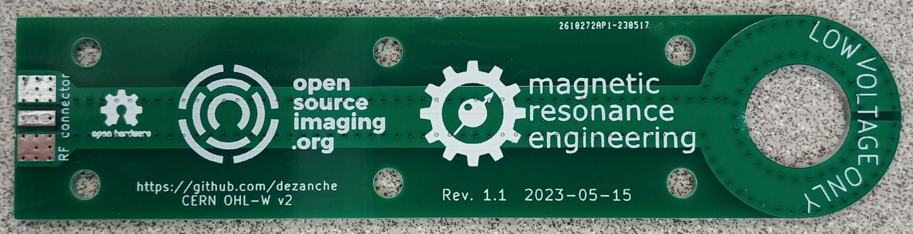
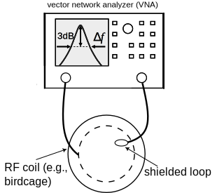
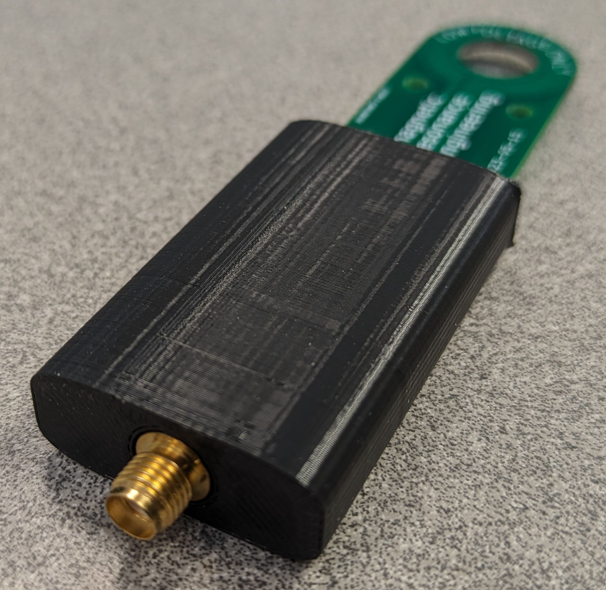
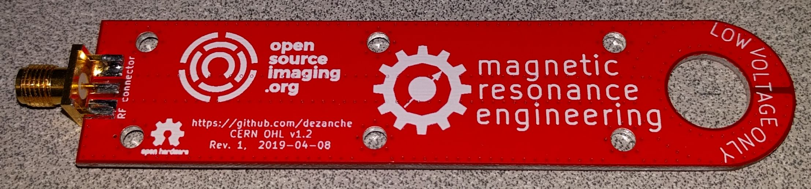
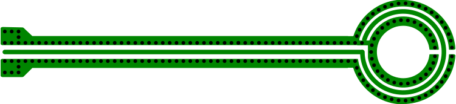

# Shielded Loop Probe for RF Magnetic Fields

## Background

Shielded loop probes have a variety of uses in RF engineering, including as "sniffer" probes for electromagnetic (EM) compatibility (EMC) or interference (EMI) measurements in conjunction with a spectrum analyzer. They are also used to measure the H fields of resonant or radiating structures (antennas). In MRI and NMR they are connected to a network analyzer (VNA) to measure the frequency response of RF detector "coils", e.g., to ensure tuning at the Larmor frequency.

The shielded loop was originally described for use as an antenna by **RE Burgess in “The Screened Loop Aerial: A Theoretical and Experimental Investigation”, The Wireless Engineer 16 (October 1939): 492–99**.

## Design

Shielded loop probes are designed to pick up magnetic (H) fields using [Faraday's law of induction](https://en.wikipedia.org/wiki/Faraday%27s_law_of_induction). They are untuned (nonresonant) and have broadband response from a few kHz to several GHz. Output voltage is measured at the probe's terminals which is typically a coaxial connector (e.g., SMA or BNC).

Most of the loop is shielded to minimize sensitivity to electric (E) fields that are often present in addition to the H field. A small gap prevents the shield from shorting the voltage produced by the H field. It is preferable to place the gap in the centre of the loop to maintain symmetry, which ensures that the response will be unchanged if the probe is rotated by 180°.

Shielded loop probes are often made by hand on the RF workbench using semi-rigid, hand-formable or flexible coaxial cable.
Photos, drawings and additional references are found in numerous sites online like https://www.uniteng.com/neildocs/references/Probing_the_Magnetic_Field_Probe.htm

Making loop probes using coax requires some skill and for small diameters it can be challenging. Reliability of the probe can also be an issue because solder joints can fail, and thin coax, even if semi-rigid, can bend quite easily. The probe described here uses a [stripline](https://en.wikipedia.org/wiki/Stripline) printed inside a circuit board (4-layer 1.6 mm FR4 PCB), making it much more rugged and rigid than coax. Connection from the board to coaxial cable is made through a side-launch connector such as the SMA connector shown in the photos below.

The PCB design is provided in both [KiCAD](https://www.kicad.org/) and Gerber format. A similar design is presented in this article: https://www.mdpi.com/2079-9292/10/18/2201

## Insulated Probe Holder
It was suggested by a [user](https://intergalaktik.eu/news/bb3-cm4-emc) that in some situations it might be useful to prevent close contact with the probe. Therefore he designed a [3D printed case](https://github.com/goran-mahovlic/H-field_RF_probe/tree/main/Case) or sleeve for his probe. I have a slightly different SMA connector on mine, and to make it fit we had to modify the case design (see [probe_sleeve.stl](https://github.com/dezanche/H-field_RF_probe/blob/main/probe_sleeve.stl)).

## Releases

1. The first release (1.0) measures 23mm wide and ~100mm in length. The diameter of the loop is approximately 18mm with a central hole about 11mm ⌀. The panelized version allows 4 identical probes to be printed on a 100mm × 100mm panel (was used because of cost savings from a specific board house). Copies of this board were distributed at the [2019 annual scientific meeting](https://www.ismrm.org/19m/) of the [ISMRM](https://www.ismrm.org/) (Montreal).
This design has a minor flaw: the whole board is covered by ground which can cause perturbation of fields throughout the length of the probe. In many cases the effect will be negligible, but for uses like near field mapping, or accurate measurement of resonance frequency this might be a concern.

2. The second release (2.0) has identical measurements to the previous release and corrects the design flaw by using smaller ground planes. Copies of this board were distributed at the [2023 annual scientific meeting](https://www.ismrm.org/23m/) of the [ISMRM](https://www.ismrm.org/) (Toronto).

Lately, probes such as these have become inexpensive and available from various sources online, so it is unlikely that further revisions of this single-loop design will be made.

## Contributors
Nicola De Zanche

Bill Hovestad

## License
Layouts and other CAD files are licensed under the [CERN-OHL-W 2.0 license](https://cern-ohl.web.cern.ch/), version 2.0 or any later version.\
\
All other original content in this repository (including this README file) is licensed under a [Creative Commons Attribution-NoDerivatives 4.0 International License](https://creativecommons.org/licenses/by-nd/4.0/).
