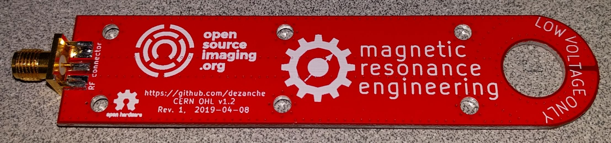

# Probe for RF Magnetic Fields

This is a shielded radio frequency (RF) magnetic field probe made on 4-layer 1.6 mm FR4 PCB.

These are typically connected to a network analyzer to measure frequency response of RF "coils" used in MRI and NMR.
Another use is EMI sniffer probe connected to a spectrum analyzer. 
Connection from the board to coaxial cable is made through a side-launch connector such as SMA.
The panelized version allows 4 identical probes to be printed on a 100mmx100mm panel.

## Contributors
Nicola De Zanche

## License
Layouts and other CAD files are licensed under the [CERN-OHL license](https://ohwr.org/project/licences/wikis/cern-ohl-v1.2), version 1.2 or any later version.\
\
All other original content in this repository (including this README file) is licensed under a [Creative Commons Attribution-NoDerivatives 4.0 International License](https://creativecommons.org/licenses/by-nd/4.0/).
